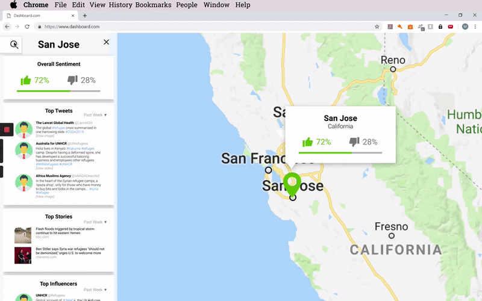
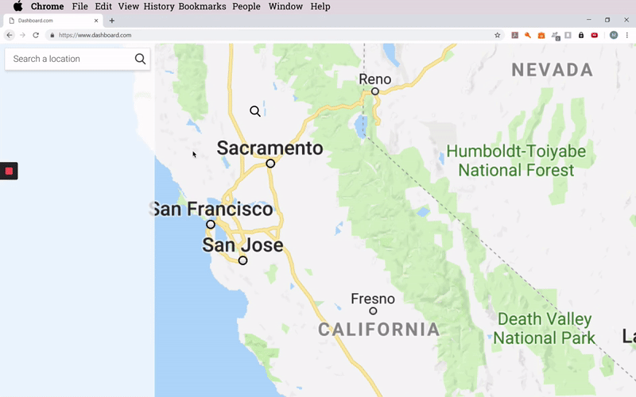
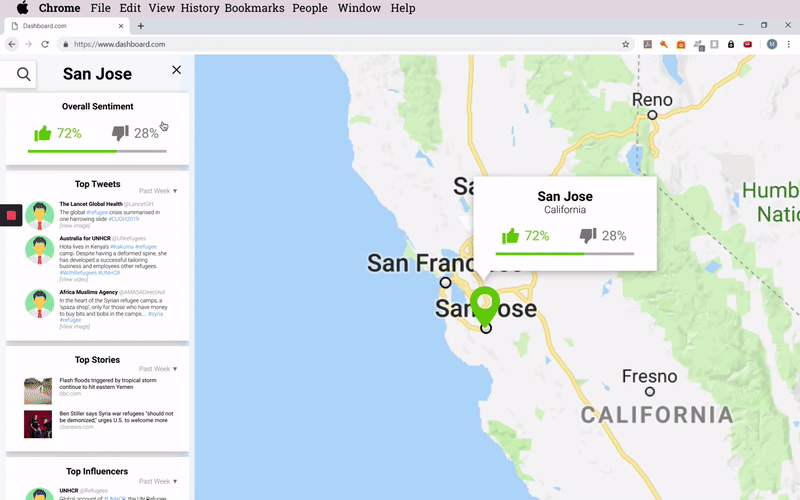

  

# The Hive
The Hive is a special projects unit of USA for UNHCR, the UN Refugee Agencency. They are a team of digital and data strategists who find creative ways of addressing the global refugee crisis. One key area of focus for the Hive is to identify strategies to increase donations. This includes increasing donor engagement and shifting the conversation around refugees in the US.

# The Challenge
Improve The Hive’s donor engagement and fundraising efficacy via social media analysis to aid in their marketing strategy development. This is best achieved in a few ways: by identifying social media “influencers”, recognizing trends in donor sentiment by geographical region, examining word usage and effectiveness in donor appeal and retention, and locating region specific refugee-related news stories.

# Our solution
Our team has had extensive conversations with the staff at Hive, including their communications team. Through these conversations, we agreed to create the following tools which can help to increase donor engagement. These tools have been be combined into a dashboard for The Hive to be able to access them easily.
* Twitter influencer tool, with geo-location - identifies Twitter users in specific regions of the US whose tweets in relation to refugees are widely retweeted or replied to.
* News aggregator - identifies refugee-related news items, especially in local news, that The Hive might not otherwise be aware of.
* Word chart - shows the frequently occurring words in social media and news items relating to refugees.

# Our Live Demo

# Who We Are
Member | Email | Bio
--- | --- | ---
JK Hunt | jkhunt@stanford.edu | JK is ...
Pamela Tham | pamtham@stanford.edu | Pamela is a student at the Graduate School of Education at Stanford. She is interested in creating and developing mastery in tools that support organizational improvement and better student outcomes. She has worked as an elementary school teacher and a civil servant in Singapore's Ministry of Education and Ministry of Finance, and is excited about how technology can help to improve access and equity in education.  
Jessica Chen | jchens@stanford.edu | Jessica is ...
Sasankh Munukutla | sasankh@stanford.edu | Sasankh is an undergraduate student at Stanford studying Computer Science from Singapore. He is passionate about fusing technology and social impact. His past experience includes social service, software and hardware projects and military leadership. With an interest in NLP and broadening perspectives, he is excited about how this project can change the conversation around the refugee crisis.
Mustafa Khan | mkhan7@stanford.edu | Mustafa is ...

# Our Development Timeline
Week | Milestone | Details
--- | --- | ---
2 | |
3 | |
4 | |
5 | |
6 | |
7 | |
8 | |
9 | |
10 | |

Thank you to:
* The Hive: Nicole Smith
* CS + SG: Tess Rinaldo and Michelle Julia
